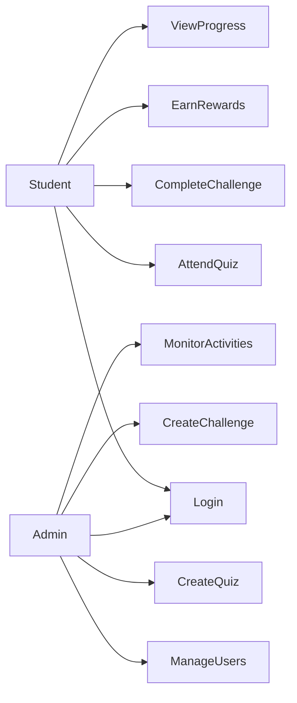
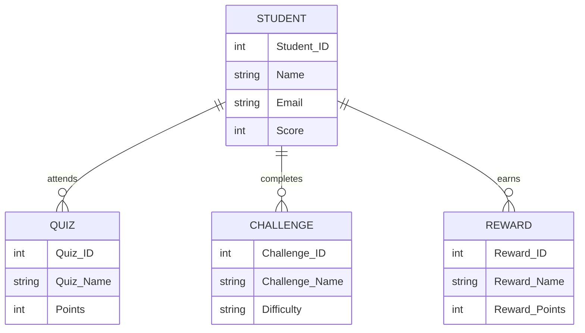

# Gamified Environmental Education Platform for Schools and Colleges

## Problem Statement

Students often lack awareness about environmental issues and sustainability practices. This project aims to improve environmental education through quizzes, challenges, rewards, and interactive activities.

# Project Objectives

- Increase environmental awareness among students.
- Encourage learning through quizzes and challenges.
- Reward students for completing activities.
- Track student learning progress.
- Promote sustainable practices.

# User Identification

## Student
- Attend quizzes
- Complete challenges
- Earn rewards
- View progress

## Admin
- Manage users
- Create quizzes
- Create challenges
- Monitor activities

# Module Identification

1. Login Module
2. Quiz Module
3. Challenge Module
4. Reward Module
5. Progress Tracking Module
6. Admin Management Module

# Use Case Diagram

# Database Requirement Analysis

## Student
- Student_ID
- Name
- Email
- Score

## Quiz
- Quiz_ID
- Quiz_Name
- Points

## Challenge
- Challenge_ID
- Challenge_Name
- Reward

## Reward
- Reward_ID
- Reward_Name
- Points

## Admin
- Admin_ID
- Name
- Email

# ER Diagram

# Database Schema

Tables:
1. Student
2. Quiz
3. Challenge
4. Reward
5. Admin

# Login and Dashboard UI

- Student Login Screen
- Admin Login Screen
- Student Dashboard
- Admin Dashboard

  # Navigation and Form Design

Forms:
- Login Form
- Quiz Form
- Challenge Submission Form

Navigation:
- Home
- Dashboard
- Quiz
- Challenges
- Rewards

  # Design Review

- Reviewed project requirements
- Verified UI design
- Verified database design
- Approved system design

  # Frontend Environment Setup

## React Project Setup

Tools Used:
- React.js
- VS Code
- GitHub

# Login Module

## Description
The login module allows students and administrators to access the system securely.

## Features
- Student Login
- Admin Login
- Username Validation
- Password Validation

# Registration Module

## Description
The registration module allows new students to create an account.

## Features
- Student Registration
- Email Validation
- Password Creation
- Profile Setup

# Dashboard UI

## Description
The dashboard displays student activities and progress.

## Features
- View Progress
- Quiz Score Display
- Rewards Display
- Challenge Status

# CRUD Form Development

## Description
CRUD operations are used to manage quizzes, challenges, rewards, and student records.

## Operations

### Create
Add new quiz or challenge.

### Read
View existing records.

### Update
Modify quiz, challenge, or reward details.

### Delete
Remove unwanted records.
